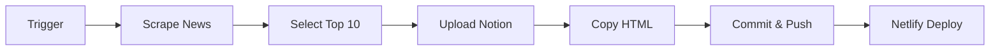

# 🤖 Automated News Dashboard - Workflow Setup

## 📋 Overzicht

De **Update News Dashboard** workflow automatiseert:
1. 📰 Scrapen van recruitment nieuws (Brave Search API)
2. 🎯 AI-powered selectie van Top 10 artikelen
3. 📤 Upload naar Notion database
4. 🌐 Deploy naar Netlify dashboard

**Trigger**: Elke maandag 08:30 CET (automatisch) + handmatig via GitHub Actions

---

## 🔐 Required GitHub Secrets

Ga naar: https://github.com/WouterArtsRecruitin/TechnicalRecruitmentNews/settings/secrets/actions

Voeg de volgende secrets toe:

### 1. `BRAVE_API_KEY`
**Wat**: Brave Search API key voor het scrapen van nieuws
**Waarde**: `BSARdxCQWTc2qwf41D9nweSyzfBzf6B`
**Verkrijgen**: https://brave.com/search/api/

### 2. `NOTION_TOKEN`
**Wat**: Notion integration token voor database uploads
**Waarde**: `ntn_e92136230611eqP1bhLrwDXKcleL5EpV1DkWm3DSb5S3Bw`
**Database**: https://www.notion.so/2421f7a1ca0141b0994d3fafab3e6eb7

### 3. `SLACK_WEBHOOK_URL` (Optioneel)
**Wat**: Slack webhook voor notificaties
**Verkrijgen**: https://api.slack.com/messaging/webhooks

---

## ✅ Setup Checklist

- [ ] **Secrets toegevoegd** in GitHub repository settings
- [ ] **Notion database gedeeld** met integration
  - Database ID: `2421f7a1-ca01-41b0-994d-3fafab3e6eb7`
  - Share met: De integration die je Notion token gebruikt
- [ ] **Netlify connected** to GitHub repo (auto-deploy enabled)
- [ ] **Workflow file** gepusht naar main branch

---

## 🚀 Workflow Gebruiken

### Handmatig Triggeren

1. Ga naar: https://github.com/WouterArtsRecruitin/TechnicalRecruitmentNews/actions
2. Selecteer **"Update News Dashboard"**
3. Klik **"Run workflow"**
4. Kies branch: `main`
5. Klik **"Run workflow"** (groene knop)

### Automatisch Schema

**Elke maandag 08:30 CET**:
- Scraper draait automatisch
- Top 10 wordt geselecteerd
- Notion wordt geüpdatet
- Dashboard wordt gedeployed

---

## 📊 Workflow Stappen



1. **Scrape News**: 34 queries via Brave Search API
2. **AI Scoring**: Artikelen scoren op thought leadership, technical relevance, etc.
3. **Notion Upload**: Top 10 naar database
4. **HTML Copy**: Latest report → `index.html`
5. **Git Push**: Automatische commit naar main
6. **Netlify**: Auto-deploy (30-60 seconden)

---

## 🔍 Monitoring

### GitHub Actions Dashboard
https://github.com/WouterArtsRecruitin/TechnicalRecruitmentNews/actions

**Zie**:
- ✅ Workflow status (success/failed)
- 📊 Aantal artikelen gescraped
- ⏱️ Run duration
- 📝 Detailed logs

### Netlify Dashboard
https://app.netlify.com/sites/technicalrecruitmentnews/deploys

**Zie**:
- 🚀 Deploy status
- 🌐 Live preview
- 📜 Deploy logs

### Notion Database
https://www.notion.so/2421f7a1ca0141b0994d3fafab3e6eb7

**Zie**:
- 📰 Top 10 artikelen
- 🎯 AI scores
- 📅 Upload timestamps

---

## 🛠️ Troubleshooting

### Workflow fails: "BRAVE_API_KEY not set"
➡️ **Fix**: Add `BRAVE_API_KEY` secret in repository settings

### Workflow fails: "NOTION_TOKEN not set"
➡️ **Fix**: Add `NOTION_TOKEN` secret in repository settings

### Notion upload fails: "Database not found"
➡️ **Fix**: Share database met de Notion integration
1. Open: https://www.notion.so/2421f7a1ca0141b0994d3fafab3e6eb7
2. Click "..." → Connections
3. Add your integration

### No articles found
➡️ **Check**: Brave API quota niet exceeded
➡️ **Check**: Queries in `generate-news-report-now.js` nog relevant

### Dashboard not updating on Netlify
➡️ **Check**: Netlify auto-deploy enabled voor `main` branch
➡️ **Check**: `index.html` was committed to repo

---

## 📝 Lokaal Testen

```bash
# Test volledige workflow lokaal
cd ~/intelligence-hub/recruitin-mcp-servers

# Scrape news
node generate-news-report-now.js

# Select top 10
node select-top-articles.js

# Upload to Notion
NOTION_TOKEN=<your-token> node upload-to-correct-notion.js

# Copy HTML
cp reports/recruitment-news-$(date +%Y-%m-%d).html \
   ~/TechnicalRecruitmentNews/index.html

# Commit & push
cd ~/TechnicalRecruitmentNews
git add index.html
git commit -m "Update dashboard"
git push
```

---

## 🔄 Workflow Aanpassen

**Frequentie wijzigen**:
```yaml
# In .github/workflows/update-dashboard.yml
schedule:
  - cron: '30 7 * * 1'  # Elke maandag 08:30 UTC
```

**Search queries aanpassen**:
```bash
# Edit: intelligence-hub/recruitin-mcp-servers/generate-news-report-now.js
const SEARCH_QUERIES = [
  // Voeg nieuwe queries toe
  'site:werf-en.nl nieuws 2026',
  // ...
];
```

**Scoring criteria aanpassen**:
```bash
# Edit: intelligence-hub/recruitin-mcp-servers/select-top-articles.js
const SCORING_WEIGHTS = {
  thought_leadership: 0.30,
  technical_relevance: 0.30,
  recruitin_fit: 0.25,
  content_opportunity: 0.15
};
```

---

## 📚 Related Documentation

- [Intelligence Hub Workflows](https://github.com/WouterArtsRecruitin/intelligence-hub/.github/workflows)
- [Notion API Docs](https://developers.notion.com/reference/intro)
- [Brave Search API](https://brave.com/search/api/)
- [GitHub Actions Docs](https://docs.github.com/en/actions)

---

**Last Updated**: 26 januari 2026
**Status**: ✅ Production Ready
